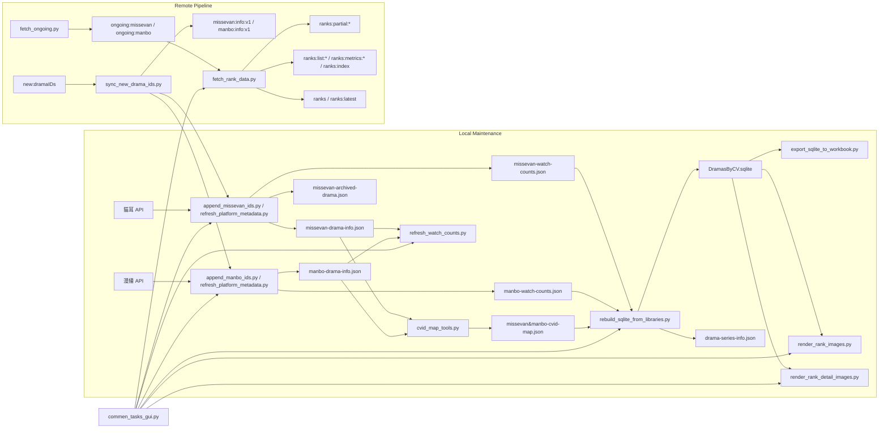

# PersonalDramaDatabase Project Architecture

## Project Overview

这个仓库当前承担两条并行的数据链路：

1. 本地源库维护与聚合报表
2. 基于 Upstash 的新剧同步、ongoing 维护和榜单发布

目标不是做一个自动串行的一体化爬虫，而是把“源库更新”“播放量刷新”“SQLite 聚合/出图”拆成可单独执行的步骤，便于限频、断点续跑和人工校对。

核心平台仍然是：

- 猫耳（Missevan）
- 漫播（Manbo）

当前功能范围已经不止于 metadata + watch count，还包括：

- 双平台主役 CV 统一映射
- 漫播收费规则清理
- 猫耳 403 剧目归档
- SQLite/Excel 导出
- 榜单抓取、ongoing 保活、弹幕 UID 统计
- 小红书风格榜单图与明细图渲染
- PySide6 桌面 GUI

## High-Level Architecture

## Core Data Assets

### Source Libraries

#### `missevan-drama-info.json`

- 当前落盘形态是“按 `dramaId` 扁平索引”的字典
- 代码仍兼容历史上的嵌套结构，`iter_missevan_nodes()` 会同时读取旧格式和新格式
- `save_missevan_store()` 会在保存前做标准化，补齐 `seriesTitle`，并去重冲突节点
- 每个节点包含：标题、分类、主役 CV、角色名、`createTime`、`author`、`needpay`、`soundIds` 等字段

#### `manbo-drama-info.json`

- 结构为 `{"version": 1, "updatedAt": ISO, "records": []}`
- 每条记录包含：`dramaId`、标题、分类、`genre/type`、主役 CV、角色名、`createTime`、`author`、`needpay`、`seriesTitle` 等字段

### Cache and Derived Data

#### `missevan-watch-counts.json` / `manbo-watch-counts.json`

- 统一结构：`{"_meta": {"updated_at": ISO}, "counts": {dramaId: {...}}}`
- 每个条目至少包含：`name`、`view_count`、`fetched_at`
- `refresh_watch_counts.py` 只维护这两份缓存，不会改 SQLite

#### `missevan-archived-drama.json`

- 只在猫耳播放量刷新阶段写入
- 当某个剧目详情请求返回 HTTP 403 时，当前活跃源库里的节点会被移出并归档到这里
- 归档节点会额外记录：`archivedReason`、`archivedAt`、`archivedWatchCount`

#### `missevan&manbo-cvid-map.json`

- 双平台 CV 的统一映射表
- 记录 canonical 名称、`missevanCvId`、`manboCvId`、`displayName`、`aliases`、`notes`、`updatedAt`
- 当前策略是“保守更新”：只补充 ID 和 alias，不自动合并歧义记录

#### `drama-series-info.json`

- 由 `rebuild_sqlite_from_libraries.py` 自动生成
- 只记录“同平台 + 同分类 + 同基础系列名”被聚合成一行的多剧目系列
- 用于后续榜单或系列映射辅助，不是手工维护主数据源

### Rank and Ongoing Stores

#### `ranks.json`

- 本地榜单缓存
- 结构为：
  - `_meta.updated_at`
  - `missevan.ranks` / `missevan.dramas`
  - `manbo.ranks` / `manbo.dramas`
- `dramas` 里除了播放量，还会缓存封面、主役、分类名、付费状态、创建时间、弹幕 UID 统计等展示字段

#### `ongoing-missevan.json` / `ongoing-manbo.json`

- 仅作为 `fetch_ongoing.py --dry-run` 的本地快照
- 当前权威数据在 Upstash 的 `ongoing:missevan` 和 `ongoing:manbo`
- payload 结构为：`version/platform/updatedAt/records`
- `records` 中每条记录至少包含：`dramaId`、`updateType`（`weekly` 或 `daily`）

### Warehouse and Outputs

#### `DramasByCV.sqlite`

- 当前聚合仓库，核心表有两张：
  - `cv_works`：每个 CV 在某个平台、某个系列上的聚合行
  - `work_drama_ids`：聚合行与原始 `dramaId` 的展开映射

#### `DramasByCV_merged.xlsx`

- 从 SQLite 导出
- 每个 CV 一张 worksheet

#### `output/xhs_rank_images` / `output/xhs_rank_details`

- 榜单图和明细图输出目录
- 完全依赖当前 SQLite 和 `DramaByCV.rank.sql`

## Module Responsibilities

### Shared Foundation: `platform_sync.py`

这是整个仓库的公共基础层，负责：

- 路径常量、JSON/缓存读写
- 文本规范化、匹配规范化
- 平台分类常量与标签映射
- 猫耳/漫播请求封装
- `MissevanRequester` 限频与 418 退避
- 猫耳主役 CV 选择、系列标题标准化、首集时间提取等复用逻辑

当前猫耳请求策略：

- `base_delay = 2.6s`
- `jitter = 1.2s`
- 418 时指数退避重试，且会在调用方保存已完成进度后退出

### Metadata and Library Maintenance

#### `refresh_platform_metadata.py`

负责“直接决定源库内容”的核心逻辑：

- `upsert_missevan_drama_ids()`：为指定猫耳 `dramaId` 建占位节点并刷新详情
- `upsert_manbo_drama_ids()`：为指定漫播 `dramaId` 建占位记录并刷新详情
- 补齐/修正 `catalog`、`catalogName`、`type`、`genre`、`createTime`、`author`、`needpay`
- 抽取主役 CV、角色名、`seriesTitle`
- 在 metadata 请求时顺手写入对应平台的 watch count 条目

这个脚本本身的 `main()` 目前是一个“辅助补刷入口”：

- 刷新双平台全年龄 metadata
- 同步刷新 SQLite 中的播放量字段
- 导出 Excel

它不是 README 推荐的日常全流程入口，但它确实是当前仓库的一部分功能。

#### `append_missevan_ids.py` / `append_manbo_ids.py`

这两个脚本是更常用的薄封装入口：

- 接收一组新 `dramaId`
- 调用 `upsert_*_drama_ids()`
- 仅针对本次涉及到的剧目更新 `missevan&manbo-cvid-map.json`
- 输出处理数、请求数/回退信息、CV map 更新结果

#### `clean_manbo_pricing.py`

作用是清理不应进入最终库的漫播记录：

- 实时请求 `dramaDetail`
- 从 `manbo-drama-info.json` 中删除免费剧和 `100红豆剧`
- 同步删除 `manbo-watch-counts.json` 里的对应缓存
- 不触碰 CV map 和 SQLite

### CV Identity Mapping: `cvid_map_tools.py`

负责双平台 CV 名称/ID 的统一：

- 从当前源库中观察主役 CV
- 用 CVID、display name、alias 多路索引尝试命中已有记录
- 只补充缺失 ID / alias / `updatedAt`
- 如果出现多条潜在命中，标记为 `ambiguous`，不自动合并

这个“保守更新”策略是当前架构里的重要约束，后续所有聚合都依赖它的稳定性。

### Watch Counts and Archive Handling: `refresh_watch_counts.py`

这个脚本只负责刷新播放量缓存：

- 支持全量刷新或按平台/按 ID 定向刷新
- 命中 1 小时缓存窗口会跳过
- 猫耳命中 418 时会先保存当前进度再退出
- 猫耳命中 403 时会把剧目移出活跃源库并写入 `missevan-archived-drama.json`

注意：

- 这是独立于 metadata 的第二阶段，不自动触发 SQLite 重建
- 目前仍保留猫耳 blocklist：`47639`、`25812`

### Warehouse Build and Export

#### `rebuild_sqlite_from_libraries.py`

这是本地报表链路的聚合核心，输入为：

- `missevan-drama-info.json`
- `manbo-drama-info.json`
- 两份 watch count 缓存
- `missevan&manbo-cvid-map.json`

聚合规则：

- 只有 `needpay == true` 的剧目会进入最终仓库
- 聚合键是：`(cv_name, platform, catalog, base_series_title)`
- 同平台、同分类、同基础系列名的多季作品会合并到一行
- 跨平台或跨分类不会合并
- `role_names` 会做 trim、汉字间空格清理、去重，再用 `/` 拼接
- `create_month` 取同一聚合桶中最早的非空月份
- `total_play_count` 是聚合桶中所有 `dramaId` 当前播放量之和；只要其中有缺失值，该聚合行就是 `NULL`

脚本会重建：

- `cv_works`
- `work_drama_ids`
- `drama-series-info.json`

#### `export_sqlite_to_workbook.py`

- 从 `cv_works` 导出 `DramasByCV_merged.xlsx`
- 每个 CV 一张表，保留剧名、类型、`dramaids_text`、角色名、总播放量、平台等字段

### Rank SQL and Image Rendering

#### `DramaByCV.rank.sql`

- 定义榜单 SQL
- 当前 GUI 的榜单预览页、榜单图和明细图都依赖它

#### `render_rank_images.py`

- 读取 `DramaByCV.rank.sql` 中的多段查询
- 默认输出 8 张 Top 30 榜单海报到 `output/xhs_rank_images`
- 可通过命令行参数或交互输入注入“猫耳/漫播数据截至日期”页脚

#### `render_rank_detail_images.py`

- 读取总榜查询和 SQLite 明细
- 生成封面 + Top30 明细分页图，输出到 `output/xhs_rank_details`
- 每个榜单页会展示该 CV 的全部聚合剧集、平台、类型、角色和播放量

### Upstash Sync and Publishing

#### `sync_new_drama_ids.py`

这是远端新剧同步入口：

- 从 `new:dramaIDs` 读取待处理队列
- 分别调用 `append_missevan_ids.py` 和 `append_manbo_ids.py`
- 把最新的 `missevan-drama-info.json` / `manbo-drama-info.json` 上传到 Upstash
- 只有当记录达到“基本可用状态”后才会从队列中 prune

当前使用的关键 Upstash key：

- `new:dramaIDs`
- `missevan:info:v1`
- `manbo:info:v1`

#### `fetch_ongoing.py`

负责维护“即便暂时不在榜上，也需要保活刷新”的 ongoing 剧集集合：

- 猫耳优先读 app timeline；失败时回退到 `summerdrama`/sound 页面抓取
- 漫播按最近 7 个北京时间零点的更新时间页抓取
- 只保留当前逻辑认为“仍需关注”的付费更新剧
- 上传到 `ongoing:missevan` 和 `ongoing:manbo`

#### `fetch_rank_data.py`

这是当前最复杂的远端数据管线，职责包括：

- 先从 Upstash partial + 最近 metrics 初始化 store；失败时回退本地 `ranks.json`
- 并行抓取双平台榜单列表
- 从 Upstash 读取 ongoing IDs，并在 stale 过滤前合并进来，确保“脱榜但仍在更新”的剧继续刷新
- 按 12 小时缓存窗口筛选需要补抓 detail 的剧目；`--force` 时忽略这个窗口
- 默认随 detail 一起更新弹幕 UID 统计
- 输出本地 `ranks.json`
- 上传 remote partial / history / full store

普通模式下的具体语义：

- 双平台同时开启时，榜单抓取并行，后续 detail 刷新也按平台并行执行
- detail 会对 rank + ongoing 合并后的去重 ID 集合做缓存判断
- 弹幕不会对所有 detail ID 都刷新，而是只对各平台的弹幕目标子集刷新：
  - 猫耳：标准榜单 + ongoing
  - 漫播：非 `peak` 榜单 + ongoing
- 传 `--skip-danmaku` 时，本次被更新到的 drama 会显式把 `danmaku_uid_count` 写成 `null`
- 如果只是“该 drama 不在本次弹幕目标子集里”，而不是全局 `--skip-danmaku`，则仍会刷新 detail，但保留已有 `danmaku_uid_count`

`--only-danmaku` 模式下的具体语义：

- 不重新抓榜单，也不重新读取 ongoing
- 直接遍历当前 store 里已有的 drama metrics
- `--force` 时，对这些现有 drama 直接刷新弹幕 UID 统计
- 不带 `--force` 时，只有在 `danmaku_uid_count` 为正且 `fetched_at` 仍在 12 小时缓存内时才跳过；其他情况都会刷新

当前 remote 输出分层如下：

- `ranks:partial:{platform}`：每个平台最新局部 shard
- `ranks:list:{date}:{platform}`：按天存榜单列表历史
- `ranks:metrics:{date}:{platform}`：按天存 drama metrics 历史
- `ranks:index`：历史日期索引，默认保留 90 天
- `ranks` 与 `ranks:latest`：合并后的完整最新 store

这个脚本还支持：

- `--skip-danmaku`
- `--only-danmaku`
- `--missevan-only` / `--manbo-only`
- 漫播付费弹幕 benchmark 模式

### Desktop GUI: `commen_tasks_gui.py`

GUI 现在不是一个简单 launcher，而是一个桌面工作台：

- 基于 PySide6
- 页签包括：`操作`、`SQLite`、`榜单预览`、`JSON 浏览`
- 操作页可执行：
  - 追加猫耳/漫播 ID
  - 同步 Upstash 新剧队列
  - 刷新播放量
  - 清理漫播收费规则
  - 重建 SQLite / 导出 Excel
  - 抓取榜单数据 / 仅更新弹幕
  - 生成榜单图 / 明细图
- SQLite 页只允许 `SELECT` / `WITH` 开头的只读 SQL

## Current Operational Flows

### 1. 本地源库维护流程

推荐顺序仍然是：

1. `append_missevan_ids.py <ids>`
2. `append_manbo_ids.py <ids>`
3. `clean_manbo_pricing.py`
4. `refresh_watch_counts.py`
5. `rebuild_sqlite_from_libraries.py --export-workbook`
6. `render_rank_images.py`
7. `render_rank_detail_images.py`

其中：

- append 阶段已经会刷新“本次命中剧目”的 metadata 和 watch count
- 但全量播放量刷新仍然故意拆成独立步骤，方便在猫耳限频后续跑

### 2. Upstash 新剧同步流程

1. 外部流程把待补剧目的 `dramaId` 写入 `new:dramaIDs`
2. `sync_new_drama_ids.py` 调用 append 脚本补齐源库
3. 脚本上传最新 `missevan:info:v1` / `manbo:info:v1`
4. 只有“最小可用字段齐全”的 ID 才会从队列删除

### 3. Ongoing + Rank 发布流程

1. `fetch_ongoing.py` 更新 `ongoing:*`
2. `fetch_rank_data.py` 抓取榜单、详情、弹幕统计
3. 本地 `ranks.json` 与 Upstash `ranks:*`/`ranks`/`ranks:latest` 同步刷新

这里 ongoing 的作用不是单独出报表，而是给 rank pipeline 提供“保活 ID 集合”。

### 4. GUI 驱动流程

`commen_tasks_gui.py` 把以上主要脚本串成桌面入口，但底层仍然是直接执行这些 Python 脚本，没有引入额外服务层。

## Key Design Rules and Failure Handling

### 1. 保守更新优先于自动修复

- CV map 不自动合并歧义记录
- append 只观察这次涉及到的剧目，不扫整库重建映射
- 很多步骤都会保留人工复核空间

### 2. 限频与断点续跑是第一优先级

- 猫耳 metadata / watch count / rank detail 在 418 时都会尽量先落盘再退出
- 播放量刷新和 metadata 刷新拆开，就是为了更好地断点恢复

### 3. `needpay` 是最终仓库的硬过滤条件

- SQLite 只收录 `needpay == true` 的剧目
- 漫播免费剧和 `100红豆剧` 会在清理阶段直接移出源库

### 4. ongoing 用来补足榜单盲区

- `fetch_rank_data.py` 不只看榜单内 ID
- 只要某部剧仍被 ongoing 逻辑认为需要保活，它就会继续参与 detail/danmaku 刷新

### 5. 本地脚本默认不自动串行

- 这是有意设计，不是缺失功能
- 目标是允许手动控制每个阶段的节奏、失败恢复点和校验点

## External Dependencies and Environment

### Python Packages

- `requests`
- `Pillow`
- `openpyxl`
- `PySide6`

### Required / Optional Environment Variables

#### Upstash

- `UPSTASH_REDIS_REST_URL`
- `UPSTASH_REDIS_REST_TOKEN`

#### 猫耳 timeline 抓取

可选使用：

- `MISSEVAN_TIMELINE_HEADERS_JSON`
- 或单独提供：
  - `MISSEVAN_TIMELINE_AUTHORIZATION`
  - `MISSEVAN_TIMELINE_COOKIE`
  - `MISSEVAN_TIMELINE_DATE`
  - `MISSEVAN_TIMELINE_NONCE`
  - `MISSEVAN_TIMELINE_USER_AGENT`

这些变量主要被 `fetch_ongoing.py` 用来优先走 app timeline。

## Tests

当前仓库里与新功能最直接对应的自动化测试主要有：

- `test_fetch_ongoing.py`
  - 覆盖猫耳 weekly/daily ongoing 解析
  - 覆盖漫播更新时间页过滤逻辑
  - 覆盖 dry-run 输出和 Upstash key
- `test_fetch_rank_data.py`
  - 覆盖 partial/history/full store 上传
  - 覆盖 ongoing 与 rank ID 合并
  - 覆盖 danmaku 目标集合选择
  - 覆盖 `--only-danmaku` 的缓存 / `0` 值 / `--force` 刷新语义
  - 覆盖普通模式下 `--skip-danmaku` 对 metric 中弹幕字段的写入语义
  - 覆盖 remote partial/fallback merge 行为

## Summary

截至当前版本，这个仓库的真实架构已经演进为：

- 以本地 JSON 源库 + 缓存为基础事实层
- 以 SQLite 为本地分析/出图仓库
- 以 Upstash partial/history/full store 为远端榜单发布层
- 以 GUI 作为桌面操作入口，而不是替代脚本本身

因此，这份架构文档的重点也从“数据格式说明”转成了“数据层 + 脚本职责 + 流程边界 + 失败恢复策略”。
